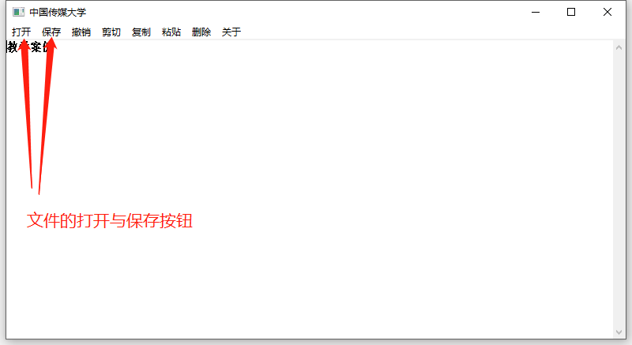
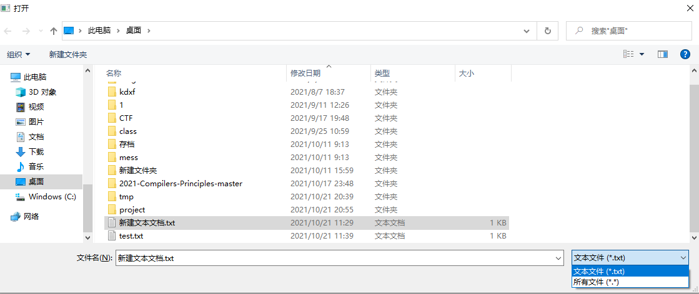
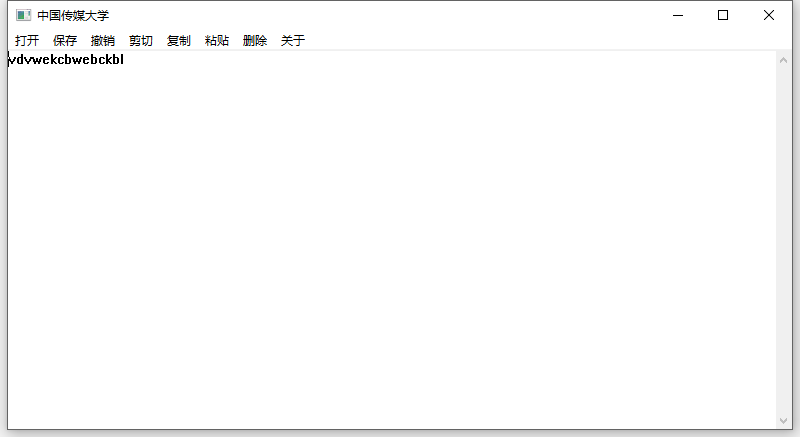
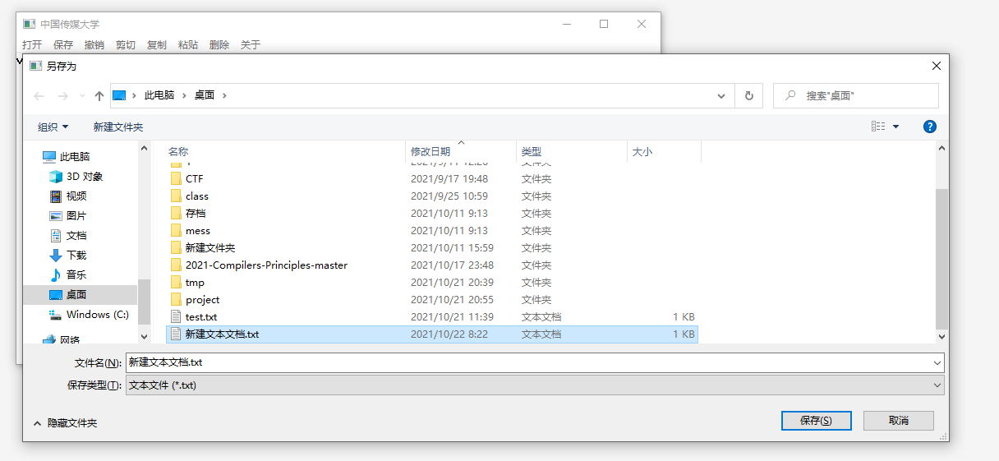

# 作业四（10.14）

## 作业要求

- 熟悉Windows API，在示例代码的基础上增加一个功能：保存和打开文件。
  - 提示：使用原生Windows API CreateFile，WriteFile，ReadFile， CloseHandle等。
  - 使用GetOpenFileName 等API函数可以创建一个选择文件对话框。


## 实验代码

- 关键代码：

  - 由于此处仅添加了两个功能，并且功能实现相似，所以这里选择在一个函数传入不同参数内实现不同功能。

  	```c
  	case IDM_OPENFILE:
      //DoFileOpenSave函数第二个参数设置为FALSE的时候是打开文件
      DoFileOpenSave(hwndEdit, FALSE);			
      break;
  						 

  	case IDM_SAVE: 
      //DoFileOpenSave函数第二个参数设置为SAVE的时候是保存文件
      DoFileOpenSave(hwndEdit, TRUE);
      break;
  	```

  - 该函数的实现方法：

    ```c
    BOOL DoFileOpenSave(HWND hwnd, BOOL bSave){
    	OPENFILENAME ofn;
    	char szFileName[MAX_PATH];
    
    
    	ZeroMemory(&ofn, sizeof(ofn));
    	szFileName[0] = 0;
    
    
    	ofn.lStructSize = sizeof(ofn);
    	ofn.hwndOwner = hwnd;
    	ofn.lpstrFilter = "文本文件 (*.txt)\0*.txt\0所有文件 (*.*)\0*.*\0\0";
    	ofn.lpstrFile = szFileName;
    	ofn.nMaxFile = MAX_PATH;
    	ofn.lpstrDefExt = "txt";//指定文件后缀为txt
    
    
    	if (bSave){
    		ofn.Flags = OFN_EXPLORER | OFN_PATHMUSTEXIST | OFN_HIDEREADONLY |
    			OFN_OVERWRITEPROMPT;
    
    		if (GetSaveFileName(&ofn))
    		{
    			//检索指定对话框中控件的句柄。
    			GetDlgItem(hwnd, IDM_SAVE);
    			if (!SaveFile(hwnd, szFileName))
    			{
    				MessageBox(hwnd, "保存文件失败.", "错误信息",
    					MB_OK | MB_ICONEXCLAMATION);
    				return FALSE;
    			}
    		}
    	}
    	else{
    		ofn.Flags = OFN_EXPLORER | OFN_FILEMUSTEXIST | OFN_HIDEREADONLY;
    		if (GetOpenFileName(&ofn))
    		{
    			//检索指定对话框中控件的句柄。
    			GetDlgItem(hwnd, IDM_OPENFILE);
    			if (!LoadFile(hwnd, szFileName))
    			{
    				MessageBox(hwnd, "打开文件失败.", "错误信息",
    					MB_OK | MB_ICONEXCLAMATION);
    				return FALSE;
    			}
    		}
    	}
    	return TRUE;
    }
    ```

- 用于加载文件的函数实现
	```c
	BOOL LoadFile(HWND hEdit, LPSTR pszFileName)
	{//用于加载文件
	HANDLE hFile;
	BOOL bSuccess = FALSE;
	
	hFile = CreateFile(pszFileName, GENERIC_READ, FILE_SHARE_READ, NULL,
		OPEN_EXISTING, 0, 0);
	if (hFile != INVALID_HANDLE_VALUE)
	{
		DWORD dwFileSize;
		dwFileSize = GetFileSize(hFile, NULL);
		if (dwFileSize != 0xFFFFFFFF)
		{
			LPSTR pszFileText;
			pszFileText = (LPSTR)GlobalAlloc(GPTR, dwFileSize + 1);
			if (pszFileText != NULL)
			{
				DWORD dwRead;
				if (ReadFile(hFile, pszFileText, dwFileSize, &dwRead, NULL))
				{
					pszFileText[dwFileSize] = 0;
					if (SetWindowText(hEdit, pszFileText))
						bSuccess = TRUE;
				}
				GlobalFree(pszFileText);
			}
		}
		CloseHandle(hFile);
	}
	return bSuccess;
	}
	
	```

- 用于保存文件函数的实现
    ```c
	BOOL SaveFile(HWND hEdit, LPSTR pszFileName)
    {//用于保存文件
	HANDLE hFile;
	BOOL bSuccess = FALSE;
	hFile = CreateFile(pszFileName, GENERIC_WRITE, 0, 0,
		CREATE_ALWAYS, FILE_ATTRIBUTE_NORMAL, 0);
	if (hFile != INVALID_HANDLE_VALUE)
	{
		DWORD dwTextLength;
		dwTextLength = GetWindowTextLength(hEdit);
		if (dwTextLength > 0)
		{
			LPSTR pszText;
			pszText = (LPSTR)GlobalAlloc(GPTR, dwTextLength + 1);
			if (pszText != NULL)
			{
				if (GetWindowText(hEdit, pszText, dwTextLength + 1))
				{
					DWORD dwWritten;
					if (WriteFile(hFile, pszText, dwTextLength, &dwWritten, NULL))
						bSuccess = TRUE;
				}
				GlobalFree(pszText);
			}
		}
		CloseHandle(hFile);
	}
	return bSuccess;
    }
    ```


- 此处就不将整个工程文件放上来了.

   - [simple_notepad.c](./simple_notepad.c)

## 实验展示

- 功能按钮上有了保存和打开文件。



- 选择打开文件，可以看到可以打开的文本文件。
	
	


- 打开后是文件的内容
	
	


- 修改之后进行文件的保存，可以自行选择保存到新的文件中还是原来的文件中。
	
	


## 参考资料

- [GetOpenFileNameA函数的使用](https://docs.microsoft.com/en-us/windows/win32/api/commdlg/nf-commdlg-getopenfilenamea)
- [GetOpenFilename](https://www.cnblogs.com/shida-liu/p/9242230.html)

