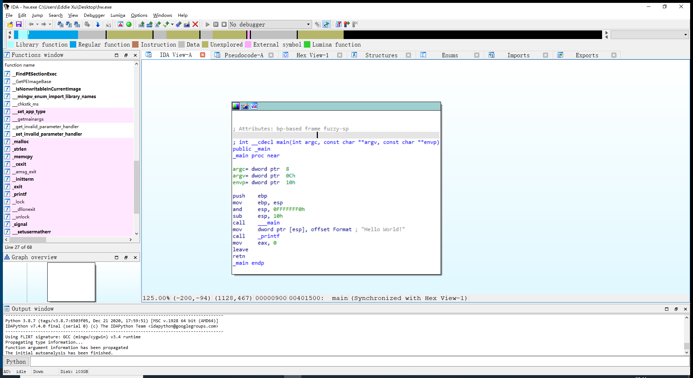
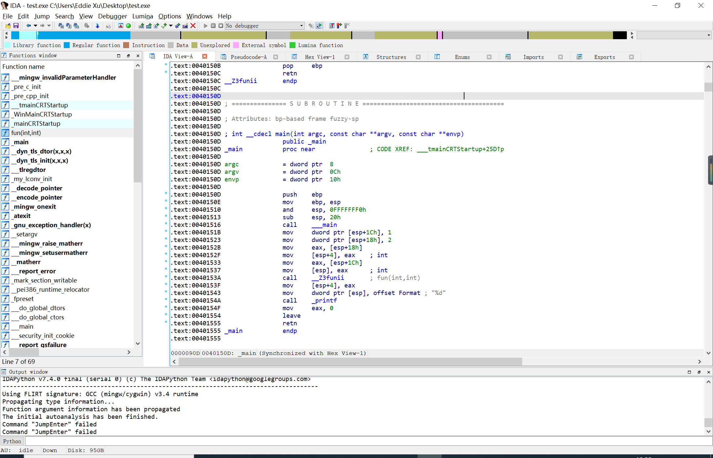

# 逆向工程 11.11日作业

许泽林 19信息安全1班 2019302120096

## 操作环境

- Windows10
- 工具：
  - Ida Pro 7.5
- 实验对象：
  - 自己编写的两个简单程序
- 实验目的：
  - 分析理解程序的反汇编代码

## 实验过程

### Hello World 程序

**源代码**
```c
#include<stdio.h>
int main(){
    printf("Hello World!");
    return 0;
}
```

**Disassembly**

- main函数反汇编代码

```asm
push    ebp;函数开始（使用ebp前先把已有值存到栈中）
mov     ebp, esp;保存当前ESP
and     esp, 0FFFFFFF0h; 这里是对齐esp到16字节
sub     esp, 10h; 抬高栈顶,相当于分配了16字节空间
call    ___main	; 调用main函数
mov     dword ptr [esp], offset Format ; "Hello World!"
call    _printf	; 调用printf函数进行结果的输出
mov     eax, 0
leave
retn
```



### 函数调用程序

**源代码**
```c
#include<stdio.h>
int fun(int a ,int b){
	return a+b;
} 

int main(){
	int a=1;
	int b=2;
	printf("%d",fun(a,b));
}
```


**Disassembly**

- main函数反汇编代码

```asm
; int __cdecl main(int argc, const char **argv, const char **envp)
public _main
_main proc near

argc= dword ptr  8
argv= dword ptr  0Ch
envp= dword ptr  10h

push    ebp								;进入一个函数，将ebp当前的值压入栈中
mov     ebp, esp						;将esp的值传递给ebp，用来存当前函数的运行地址，方便之后恢复
and     esp, 0FFFFFFF0h					;将esp与0FFFFFFF0h进行与操作
sub     esp, 20h						;将esp值减20h，因为要跳转到下一条执行语句
call    ___main							;调用main函数
mov     dword ptr [esp+1Ch], 1			;将1移入[esp+1Ch]这一地址（相当于进行赋值a=1）
mov     dword ptr [esp+18h], 2			;将2移入[esp+18h]这一地址（相当于进行赋值b=2）由于该程序是32位程序，每次操作int型变量栈顶指针减少4个字节
mov     eax, [esp+18h]					;将[esp+18h]这一地址的值移入eax寄存器（也就是将1存入寄存器）	
mov     [esp+4], eax    ; int			;将eax寄存器中的值先存入[esp+4]栈的这个位置
mov     eax, [esp+1Ch]					;将[esp+1Ch]这一地址的值移入eax寄存器（也就是将2存入寄存器）	
mov     [esp], eax      ; int			;将eax的值移入[esp]指针指向的地址
call    __Z3funii       ; fun(int,int)	;调用fun函数，传入两个int型变量
mov     [esp+4], eax					;将eax寄存器的值移入[esp+4]的位置
mov     dword ptr [esp], offset Format  ; "%d"
call    _printf							;调用printf函数进行结果的输出
mov     eax, 0							;将0移入eax寄存器
leave
retn									;函数结束
_main endp

```




- fun函数反汇编代码

```asm
; _DWORD __cdecl fun(int, int)
public __Z3funii
__Z3funii proc near

arg_0= dword ptr  8
arg_4= dword ptr  0Ch

push    ebp							;调用函数的两步基本操作
mov     ebp, esp
mov     edx, [ebp+arg_0]			;将[ebp+arg_0]地址中的值移入edx寄存器。[ebp+arg_0]为[esp+18h]，2
mov     eax, [ebp+arg_4]			;将[ebp+arg_4]地址中的值移入eax寄存器。[ebp+arg_0]为[esp+1Ch]，1
add     eax, edx					;将edx的值加到eax
pop     ebp							;函数结束，将ebp出栈
retn								;函数结束
__Z3funii endp

```


由于相关先验知识的内容在之前的实验报告中已记录，这里不再重复: [传送门](https://github.com/2019CUCCS/re-exp-EddieXu1125/blob/exp1/9.16%E6%97%A5%E4%BD%9C%E4%B8%9A/exp1.md)

## 参考资料
- [从负开始学汇编0](https://aryb1n.github.io/2017/07/22/%E4%BB%8E%E8%B4%9F%E5%BC%80%E5%A7%8B%E5%AD%A6%E6%B1%87%E7%BC%960/)
