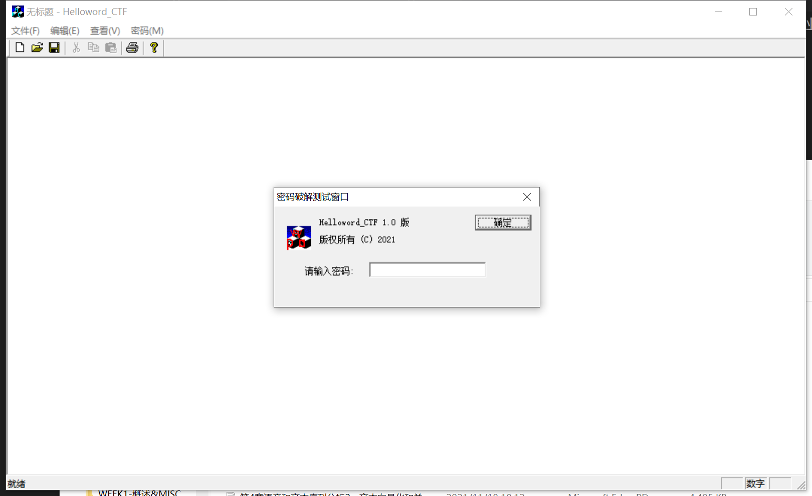
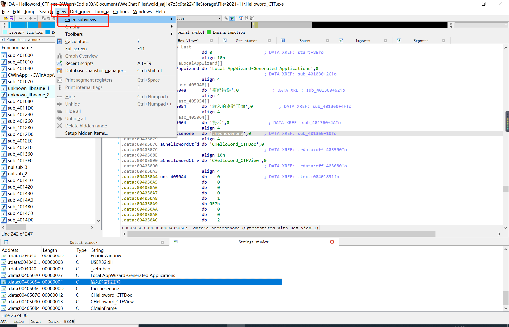
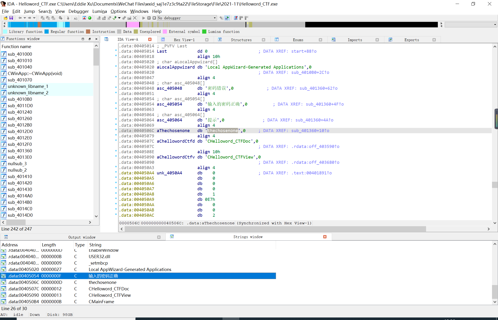

# 逆向工程与软件安全11.18日作业

许泽林 19信安1班 2019302120096

## 操作环境

- Windows10
- 工具：
  - Ida Pro 7.5
- 实验对象：
  - Helloword_CTF.exe
- 实验目的：
  - 寻找该程序隐藏的密码

## 实验过程

1. 使用ida打开该程序

2. 在工具栏寻找 `View->Opensubview->String`

打开了一个`string window`,双击进入有汉字的一行。

可以看到还有几个汉字

得到密码：**thechosenone**

PS. 当遇到对字符串进行加密的时候这种方法就不行了，需要使用新的方法。想到的方法是 attach to process ，动态调试。 由于密码输入点击确定后会弹出一个提示框，所以可以跟踪 messagebox这个win32 api函数
