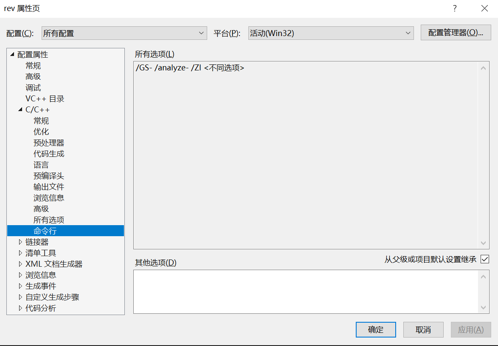
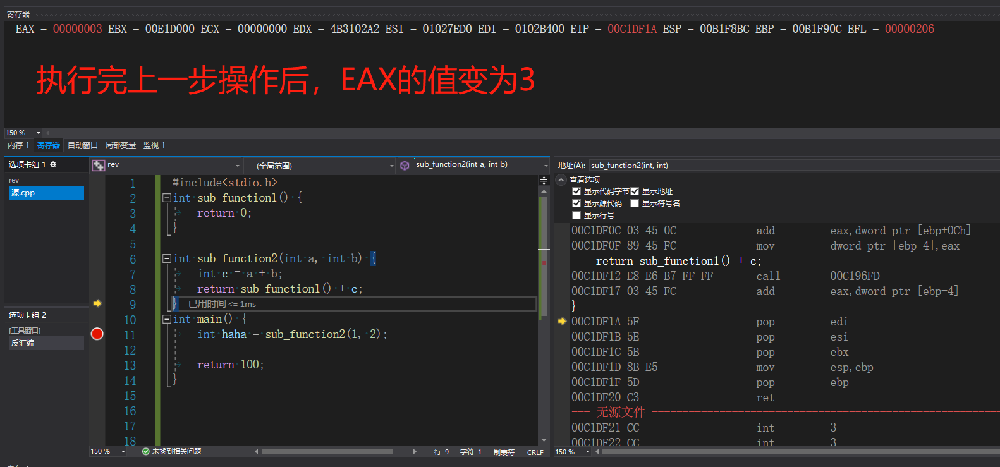

## 逆向工程 9.16日作业

---

### 先验知识

阅读《逆向工程核心原理》并结合自己理解：

#### 1. 寄存器

- **EAX** 
  - "累加器"(accumulator), 它是很多加法乘法指令的缺省寄存器。
- **EBX** 
  - "基地址"(base)寄存器, 在内存寻址时存放基地址。
- **ECX** 
  - 计数器(counter), 是重复(REP)前缀指令和LOOP指令的内定计数器。
- **EDX** 
  - 总是被用来放整数除法产生的余数。
- **EBP（重要）**
  - 基址指针寄存器(extended base pointer)，其内存放着一个指针，该指针永远指向系统栈最上面一个栈帧的底部。最经常被用作高级语言函数调用的**框架指针(frame pointer)**
- **ESP（重要）**
  - 栈指针寄存器(extended stack pointer)，其内存放着一个指针，该指针永远指向系统栈最上面一个栈帧的栈顶。压入堆栈的数据越多，ESP也就越来越小。**在32位平台上，ESP每次减少4字节。**
- **EIP**
  - 指令指针。当CPU执行完当前的指令后，从EIP寄存器中读取下一条指令的内存地址，然后继续执行。
- **ESI/EDI**
  - 源/目标索引寄存器"(source/destination index),因为在很多字符串操作指令中, DS:ESI指向源串,而ES:EDI指向目标串

---

  #### 2.栈

  需要先知道栈的特征，其存储结构为：

   

  栈就是CPU寄存器里的某个指针所指向的一片**内存**区域。
   
  向栈压入数据时，栈顶指针减小，向低地址移动；从栈中弹出数据时，栈顶指针增加，向高地址移动。

---

  #### 3. 栈帧

  栈帧就是利用EBP（栈帧指针）寄存器访问栈内局部变脸、参数、函数返回值等的手段。

   调用某函数时，要先把用作基准点（函数起始地址）的ESP保存在EBP，并维持在函数内部。这样，无论ESP的值如何变化，以EBP的值为基准base能够安全访问到相关函数的局部变量、参数、返回地址等，这就是EBP寄存器作为栈帧指针的作用。

   ```asm
   # 栈帧结构
   PUSH EBP			    ;函数开始（使用EBp前先把已有值存到栈中）
   MOV EBP,ESP			;保存当前ESP
   
   ...					    ;函数体，无论ESP值如何变化，EBP都不变，可以安全访问函数的局部变量、参数
   
   MOV ESP,EBP			;将函数的起始地址返回到ESP中
   POP EBP				  ;函数返回前弹出保存在栈中的EBP值
   RETN				      ;函数终止
   ```
  这样一来,EBP 构成了该函数的一个框架, 比EBP地址大的地址分别是原来的EBP, 返回地址和参数. 比EBP地址小的地址则是临时变量. 函数返回时作 mov esp,ebp/pop ebp/ret 即可.

  每运行一个函数就新开一段栈空间，所谓的开栈空间就是移动ebp栈底，在移动ebp之前，通过push ebp保存上一级函数的栈底，然后用ebp指向现在函数栈的栈顶，即为当前函数开辟了栈；接着给局部变量进行地址分配以及保存现场等，esp不断向低地址移动，当函数调用结束时，esp指回当前函数的栈顶(mov esp,ebp)，然后上一级函数的栈顶地址出栈保存在ebp中（pop ebp）。因此，每一个函数的栈顶上面都保存着上一级函数的栈顶地址，用于当前函数结束时能够返回上一级函数的栈，通过ebp和esp以及压栈出栈操作对栈进行维护。
   

---

### 实验步骤

#### 1、在vs中建立工程，修改编译选项，只保留/ZI（调试）和pdb文件路径两个选项。增加禁用安全检查选项（/GS-）



---

#### 2、编译多个函数调用的示例代码。

在VisualStudio中运行的代码

```c
#include<Windows.h> 
int sub_function1() {
	return 0;
}

int sub_function2(int a, int b) {
	int c = a + b;
	return sub_function1() + c;
}
int main() {
	int haha = sub_function2(1, 2);
	return 100;
}
```

---

#### 3、下断点调试运行，观察反汇编、寄存器、内存等几个调试时的信息。

① 在 `main函数中的int haha = sub_function2(1, 2);` 处下断点


② 在 `main函数` 调用 `sub_function2函数` 的反汇编过程


```asm
;进入该函数时各个寄存器的值：
EAX = 00C7DE2C EBX = 00E1D000 ECX = 00000000 EDX = 4B3102A2 ESI = 01027ED0 EDI = 0102B400 EIP = 00C1DF39 ESP = 00B1F91C EBP = 00B1F96C EFL = 00000206 

  int haha = sub_function2(1, 2);
00C1DF39 6A 02                push        2         ;先将参数2压入栈中
	int haha = sub_function2(1, 2);
00C1DF3B 6A 01                push        1         ;再将参数1压入栈中
00C1DF3D E8 32 C3 FF FF       call        00C1A274  ;调用sub_function2.见图2.1
00C1DF42 83 C4 08             add         esp,8  
00C1DF45 89 45 FC             mov         dword ptr [ebp-4],eax  
```

下面是另一次运行时的信息，流程相同，只是地址发生变化。（第一次忘记截图了）


③ 进入 `sub_function2函数` 的反汇编过程
```asm
;进入该函数时各个寄存器的值：

EAX = 00C7DE2C EBX = 00E1D000 ECX = 00000000 EDX = 4B3102A2 ESI = 01027ED0 EDI = 0102B400 EIP = 00C1DF00 ESP = 00B1F910 EBP = 00B1F96C EFL = 00000206 

int sub_function2(int a, int b) {
00C1DF00 55                   push        ebp       ; 在函数开始的时候将ebp压入栈中
00C1DF01 8B EC                mov         ebp,esp   ; 将esp的值赋给ebp：ESP = 00B1F90C EBP = 00B1F90C 
00C1DF03 83 EC 44             sub         esp,44h   ; 这一步给局部变量分配足够大的栈空间，现在ESP = 00B1F8C8
00C1DF06 53                   push        ebx  
00C1DF07 56                   push        esi  
00C1DF08 57                   push        edi       ; ebx、esi和edi压栈，esp = esp - 4*3 
	int c = a + b;
00C1DF09 8B 45 08             mov         eax,dword ptr [ebp+8]     ; 到上一个栈帧中寻找传入的参数a。注意多数栈是逆增长的，也就是向低地址增长，寻找之前栈帧参数就要加上一部分地址。）见图2.1
00C1DF0C 03 45 0C             add         eax,dword ptr [ebp+0Ch]   ; 到上一个栈帧中寻找传入的参数b ,并将其加入到eax寄存器中。见图2.2
00C1DF0F 89 45 FC             mov         dword ptr [ebp-4],eax     ; 将eax寄存器中的值传入ebp-4的位置，即0x00B1F908，此为变量c在栈中的地址,见图2.3
	return sub_function1() + c;
00C1DF12 E8 E6 B7 FF FF       call        00C196FD  ; 准备调用sub_function1，见图2.4
```

图2.1

图2.2

图2.3


跳转到sub_function1的语句、流程相同，只是地址发生变化。（第一次忘记截图了）


④ 进入 `sub_function1函数` 的反汇编过程
```asm
EAX = 00000003 EBX = 00E1D000 ECX = 00000000 EDX = 4B3102A2 ESI = 01027ED0 EDI = 0102B400 EIP = 00C1DEE0 ESP = 00B1F8B8 EBP = 00B1F90C EFL = 00000206 

#include<stdio.h>
int sub_function1() {
00C1DEE0 55                   push        ebp       ; 此处00C1DEE0的地址和EIP指针中的地址相同
00C1DEE1 8B EC                mov         ebp,esp  
00C1DEE3 83 EC 40             sub         esp,40h   ; 在堆栈中为该函数分配一定的大小，用于存储变量等信息
00C1DEE6 53                   push        ebx  
00C1DEE7 56                   push        esi  
00C1DEE8 57                   push        edi  
	return 0;
00C1DEE9 33 C0                xor         eax,eax   ;将eax中的值与自己异或，即为ie，将其返回
}
00C1DEEB 5F                   pop         edi  
00C1DEEC 5E                   pop         esi  
00C1DEED 5B                   pop         ebx  
00C1DEEE 8B E5                mov         esp,ebp  
00C1DEF0 5D                   pop         ebp  
00C1DEF1 C3                   ret  
```

⑥ 跳出 `sub_function1` ,进入 `sub_function2`
```asm
00C1DF17 03 45 FC             add         eax,dword ptr [ebp-4]  
}
00C1DF1A 5F                   pop         edi  
00C1DF1B 5E                   pop         esi  
00C1DF1C 5B                   pop         ebx  
00C1DF1D 8B E5                mov         esp,ebp  
00C1DF1F 5D                   pop         ebp  
00C1DF20 C3                   ret         ;返回main函数
```

这里的eax在function1中被用作返回值，这里将function2中的c的值与其进行相加，将eax中的值用作function2的返回值。





⑤ 返回 `main函数` 的反汇编过程
```asm
int main() {
00C1DF30 55                   push        ebp  
00C1DF31 8B EC                mov         ebp,esp  
00C1DF33 83 EC 44             sub         esp,44h  
00C1DF36 53                   push        ebx  
00C1DF37 56                   push        esi  
00C1DF38 57                   push        edi  
	int haha = sub_function2(1, 2);
00C1DF39 6A 02                push        2  
00C1DF3B 6A 01                push        1  
00C1DF3D E8 32 C3 FF FF       call        00C1A274  
00C1DF42 83 C4 08             add         esp,8  
	int haha = sub_function2(1, 2);
00C1DF45 89 45 FC             mov         dword ptr [ebp-4],eax   ; 将eax的值传入ebp-4的位置，即haha变量的位置。

	return 100;
00C1DF48 B8 64 00 00 00       mov         eax,64h  
}
00C1DF4D 5F                   pop         edi  
00C1DF4E 5E                   pop         esi  
00C1DF4F 5B                   pop         ebx  
00C1DF50 8B E5                mov         esp,ebp  
00C1DF52 5D                   pop         ebp  
00C1DF53 C3                   ret         ;main函数的返回函数
```


---

#### 4、分析函数调用过程中，栈的变化，解释什么是栈帧？ebp寄存器在函数调用过程中的变化，以及作用。

接下来对涉及函数操作栈和ebp、寄存器的部分进行查看：

1. 进入main函数
 
```
007CDF30 55                   push        ebp  
007CDF31 8B EC                mov         ebp,esp
```


2. 调用sub_function2函数

将ebp中的地址压入栈中

```asm
007CDF00 55                   push        ebp  
007CDF01 8B EC                mov         ebp,esp  
007CDF03 83 EC 44             sub         esp,44h 
```


3. 调用sub_function1函数

```
007CDF00 55                   push        ebp  
007CDF01 8B EC                mov         ebp,esp  
007CDF03 83 EC 44             sub         esp,44h 
```

**栈的总变化**

图示即为esp指针的变化情况


[栈帧](#3-栈帧)

#### 5、函数局部变量和参数的保存位置、访问方式是什么。

- 函数的局部变量和参数保存在栈帧中(归根到底是在内存中)


- 访问方式：通过访问相对于ebp的偏移，比如`add eax,dword ptr [ebp-4]`

---

#### 6、多层的函数调用，栈的变化情况，解释未赋初始值的局部变量的值是如何形成的。


由于pop操作并不是真正将数据从内存中删除，只是栈指针发生变化，让该数据从栈帧中"消失"。

部分函数的返回值留存在内存中，当未赋初始值的局部变量与其地址恰好重合时，就会造成：**未赋初始值的局部变量有值的情况**

---


>  为了熟悉ida的使用，在DevC++中编写一份cpp文件，放在ida中进行分析：

在DevC++中运行的代码

```c
//StackFrame.cpp

#include<stdio.h>
long add(long a,long b){
	long x=a,y=b;
	return (x+y);
}

int main(){
	long a = 1,b=2;
	printf("%d\n",add(a,b));
	return 0;
}
```


### 参考资料

- [逆向工程核心原理](https://m.douban.com/book/subject/25866389/)
- [关于汇编：ESP和EIP寄存器有什么区别](https://www.codenong.com/40324514/)