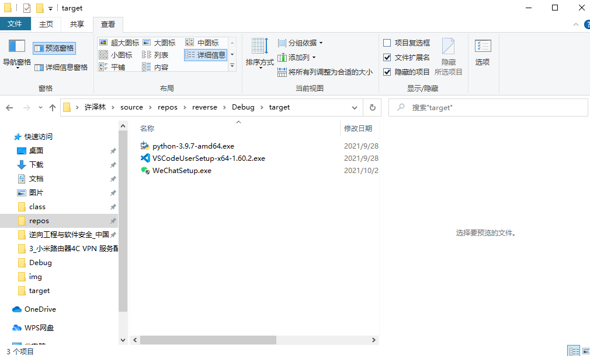
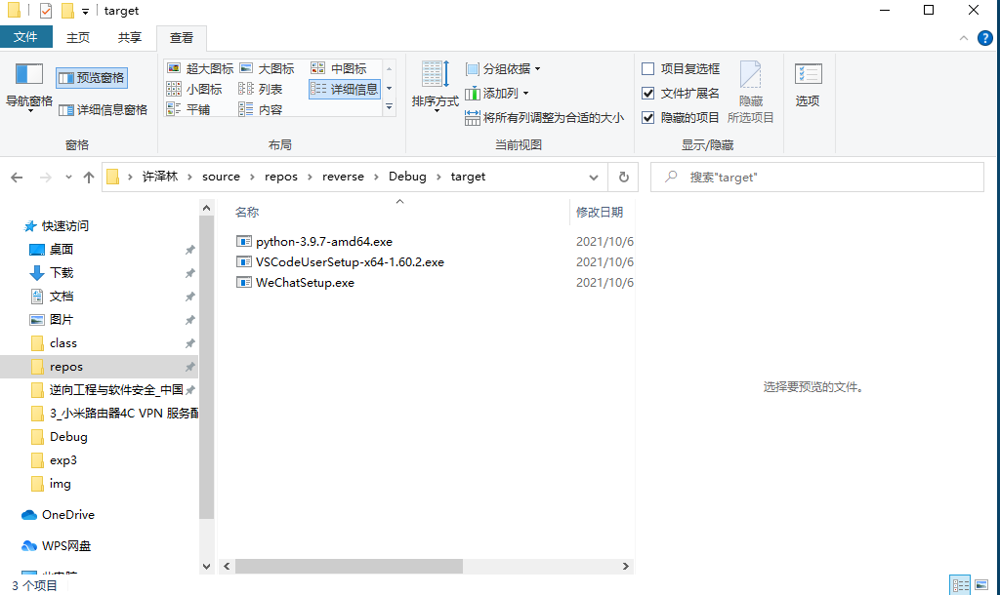
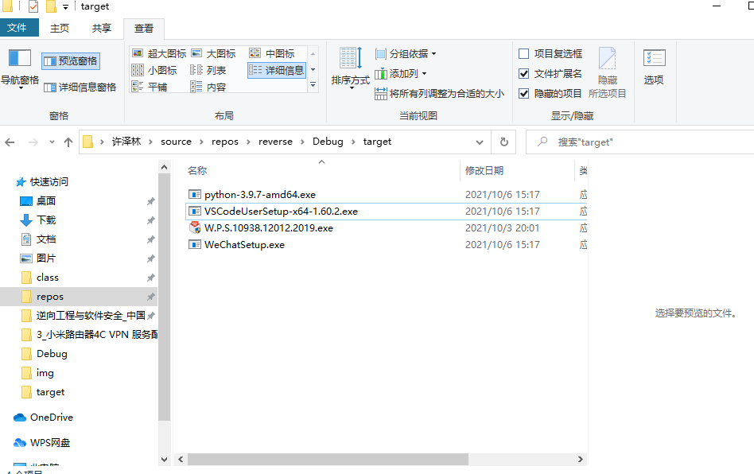

# 第三次实验


## 作业二：

---

### 实验目的：

熟悉 `Win32 API ` 的使用方法

阅读微软官方文档学习 **CreateFile、WriteFile、ReadFile、CloseHandle、FindFirstFile，FindNextFile** 等几个API函数。

---

### 实验要求
1. 遍历磁盘，找出磁盘中的全部exe文件。
2. 替换所有exe文件为自身。

**注:** 这个实验有危险，建议在虚拟机中进行。或者遍历文件时，只遍历一个自己指定的目录，避免误伤系统文件和其他有用的文件。

---

### 实验过程

由于这里是演示实验，所以范围只限于**指定文件夹**。



如果想扩大下影响范围，可以在系统的根目录下进行操作：

1. 获得Windows目录
```c
UINT GetSystemDirectory{
    LPTSTR lpBuffer,    //buffer for system directory
    UINT uSize          //size of directory buffer
};
```
两个参数，分别如下：

- lpBuffer：指定一个字符型的缓冲区，用于保存系统目录的路径。

- uSize：指定缓冲区的大小。

2. 获得系统目录
   
```c
UINT GetSystemDirectory{
    LPTSTR lpBuffer,    //buffer for system directory
    UINT uSize          //size of directory buffer
};
```

两个参数，分别如下：

- lpBuffer：指定一个字符型的缓冲区，用于保存系统目录的路径。

- uSize：指定缓冲区的大小。


**实验结果：**

运行完程序之后发现都变成了自己编写的病毒程序。



再放进来一个新的程序，然后再次去运行该文件夹中的文件，同样会被感染。



[演示视频](./img/result2.mp4)

---

### 实验源码：

[virus_code](./virus.cpp)

---

### 参考链接：

- [CreateFileA function (fileapi.h)](https://docs.microsoft.com/en-us/windows/win32/api/fileapi/nf-fileapi-createfilea)

- [FindFirstFileA function (fileapi.h)](https://docs.microsoft.com/en-us/windows/win32/api/fileapi/nf-fileapi-findfirstfilea)

- [CopyFile function (winbase.h) - Win32 apps | Microsoft Docs](https://docs.microsoft.com/en-us/windows/win32/api/winbase/nf-winbase-copyfile)