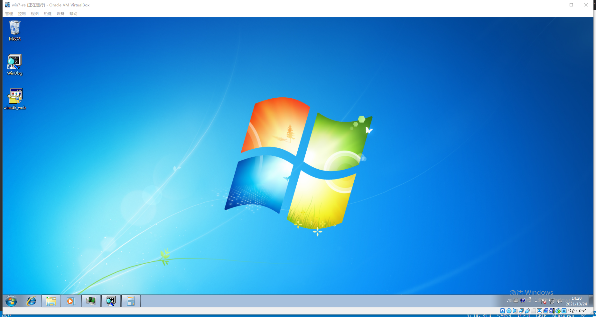
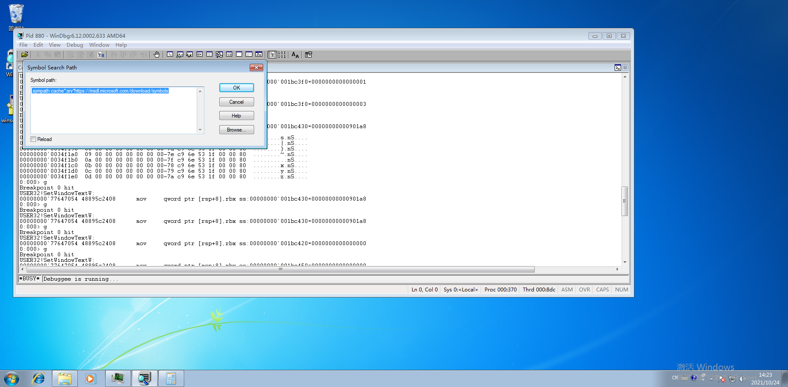
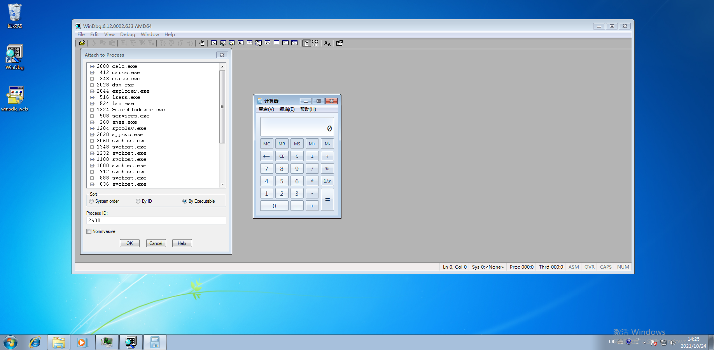
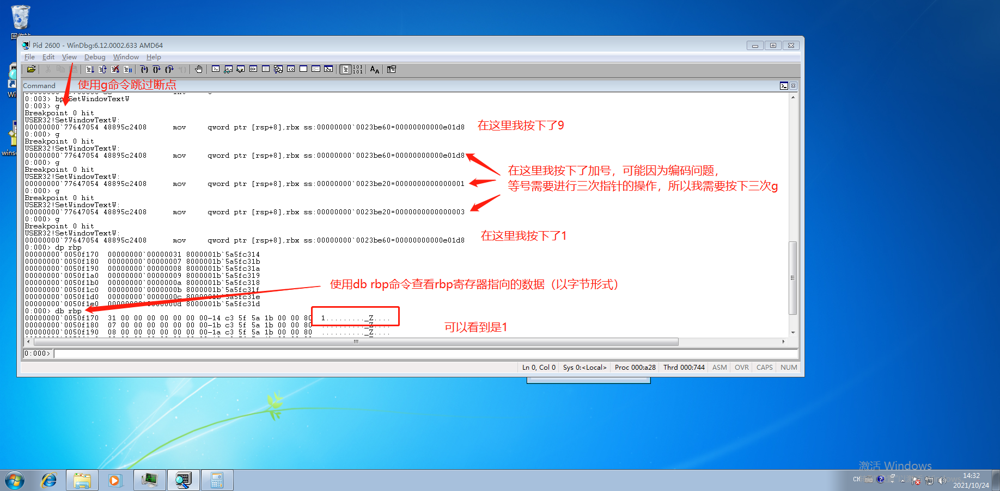
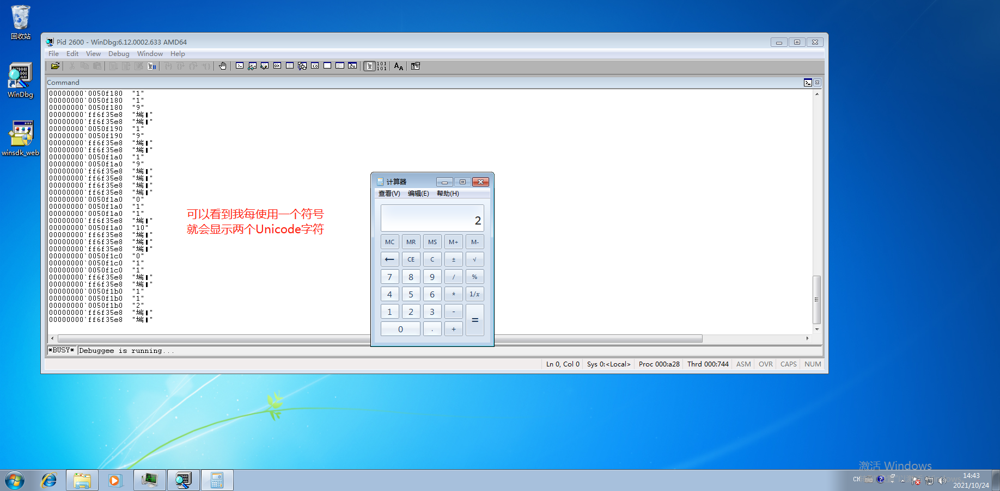
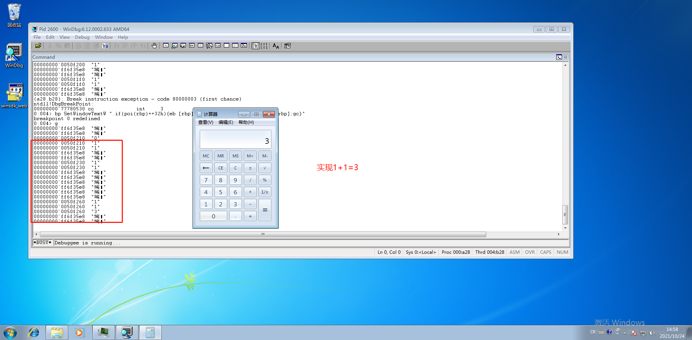

# 实验五

## 使用Windbg对计算器显示结果进行篡改

---

## 实验环境

- Windows 7 旗舰版
- windbg.exe
- calc.exe

## 实验步骤

**环境准备**

- 按照[博客](https://blog.csdn.net/luchengtao11/article/details/82379374)安装windbg



- 在windbg中参照[Symbol path for Windows debuggers](https://docs.microsoft.com/en-us/windows-hardware/drivers/debugger/symbol-path#using-agestore-to-reduce-the-cache-size)进行配置



**实验步骤**

1. 先打开一个计算器进程
2. 在windbg中选择 `attach to process` ，找到`calc.exe`进行追踪

3. 为 `SetWindowTextW` 符号设置断点

```
bp SetWindowTextW
```

然后可以发现计算器 “卡” 住了，这是因为SetWindowTextW 函数用来更改指定窗口标题栏的文本（如果有的话），当计算器在使用的时候（也就是窗口栏在变动），就会停在断点处

我们使用 `g` 命令继续执行.

下面是我按下 `9+1` 的过程：



4. 持续查看按下按钮时寄存器的变化

使用du命令

> **du**	: 	显示Unicode 字符。 每一行最多可显示48个字符。 显示将继续直到第一个 null 字节或范围内的所有字符都显示出来。 所有非打印字符（如回车符和换行符）都作为句点 ( 显示。 ) 。

```
bp SetWindowTextW "du [rbp];g"
```



5. 使用 `if-else` 进行修改，让计算器出现2的时候变为3

命令的含义：

1. > E \* 命令在内存中输入指定的值。eb输入字节值。

2. > poi操作符在WinDBG中可以被用来对指针进行解引用. 类似C语言中对指针的操作符*.

3. > gc 命令以与单步执行、跟踪或自由执行断点 (从条件断点恢复) 。

命令使用：

```
bp SetWindowTextW ".if(poi(rbp)==32h){eb [rbp] 33h;du [rbp];gc} .else{du [rbp];gc}"
```



## 演示视频

[1+1实现过程.mp4(上述过程的视频版，请在视频播放器中打开)](./1+1实现过程.mp4)


## 参考资料
- [WinDbg 和其他 Windows 调试器中的条件断点](https://docs.microsoft.com/zh-cn/windows-hardware/drivers/debugger/setting-a-conditional-breakpoint)
- [j（执行 If - Else）](https://docs.microsoft.com/zh-cn/windows-hardware/drivers/debugger/j--execute-if---else-)
- [Symbol path for Windows debuggers](https://docs.microsoft.com/en-us/windows-hardware/drivers/debugger/symbol-path#using-agestore-to-reduce-the-cache-size)