# 11.25日实验九
## ---为exe程序手工添加弹出消息对话框

## 实验目的

- 对给出的程序 `HelloworldCTF.exe` 进行魔改，使之在双击进入程序后，最先弹出的不是原先的程序窗口，而是一个有特定内容的消息框。


---

## 先验知识

**PE文件结构**

- PE文件具有较强的移植性
- PE结构是一种数据组织方式
- PE结构主要应用于windows系统
- 具有PE结构的文件称为PE文件
- EXE、DLL都是PE文件

一个完整的PE文件主要有4个部分组成：DOS头，PE头，节表以及节数据。
1. Dos部分主要用来对非FE格式文件的处理，DOS时代遗留的产物，是PE文件的一个遗传基因;
2. PE头部分用于宏观上记录文件的一些信息，，运行平台，大小，创建日期，属性等。
3. 节表部分用于对各中类型的数据进行定义分段;
4. 节数据不言而喻就是文件的数据部分，实际上我们编写程序的过程中就是对该部分的数据进行编写。而其他的部分则是由编译器依照我们编写的部分进行相应的填写而得到的。

那么这次试验最重要的知识点就是 **入口点、节表**

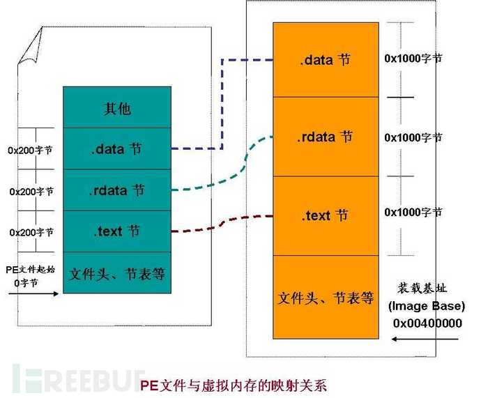  

入口点(OEP)：首先明确一个概念就是OEP是一个RVA，然后使用OEP +Imagebase ==入口点的VA，通常情况下，OEP指向的不是main函数。

可以通过修改entry point修改程序一开始执行的内容，从而达到我们的目的。

---

## 需求分析

### 总体思路：

- 从入口开始执行自己编辑的代码，执行完成后跳转回去，继续执行原来的代码。

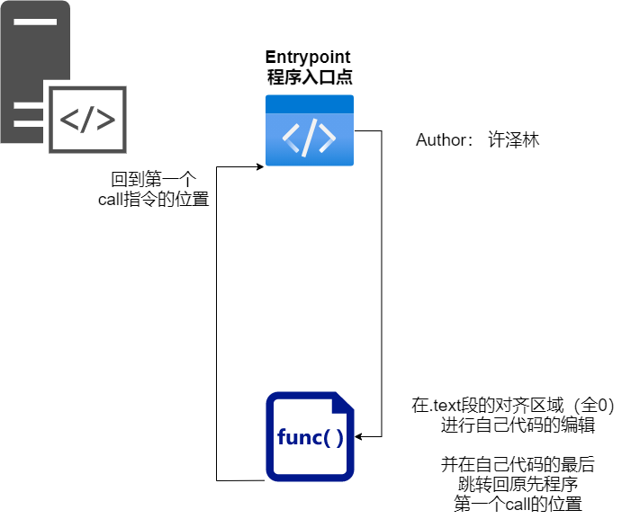


### 具体操作流程：

1. 找到合适的位置并编辑自己的代码逻辑
2. 修改入口代码，跳转到自己代码的地址
3. 跳转回到原先第一个call指令的位置

---

## 实验过程

### 实验环境

- 操作系统
  - VMWare -- Windows 7 x64
- 使用工具
  - Ollydbg
  - 010editor
  - PEBrowse 64 

#### 1.寻找合适的位置并编辑自己的代码逻辑

- 为了方便，先用任意一款PE解析器查看结构，找到text节区


计算公式： **PointTorawDate + VirtualSize = 10C0+1000 = 20C0**

使用十六进制编辑器 0101editor 打开这个程序，发现20C0真的是空的，我们可以在这里添加我们想要进行修改的代码。

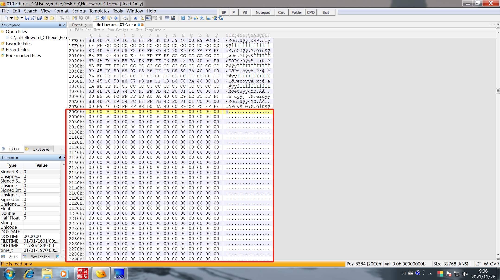


- 在之前的分析中，我使用吾爱破解工具包里面的ollydbg对messagebox下了断点，触发的时候发现他是这个样子的。

上次分析的截图：


在调用messagebox函数之前会先向栈中压入4个变量，代表的是该函数所需要的4个参数。其中第一个和最后一个填0，第二个参数是弹窗内容，第三个参数是弹窗标题。由于压栈的顺序与真实顺序是相反的，所以实际上第二条要push弹窗标题，第三条要push弹窗内容。

```c
// 该函数的结构体
int MessageBoxA(
  [in, optional] HWND   hWnd,
  [in, optional] LPCSTR lpText,
  [in, optional] LPCSTR lpCaption,
  [in]           UINT   uType
);
```

我进行照猫画虎的操作：

在对齐的区域中找到一个合适的位置，和原先的代码段空出一定距离。那么我找的是 **004020CA** 这个位置。

点击这个地址，按下空格，输入想要插入的命令。

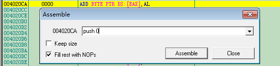

我需要依次输入下面的内容

```asm
push 0
push 4024AA
push 4024AA
push 0
```

其中 `push 4024AA`  这两行是为了占位使用，后续我需要写入unicode字符串，这两个地址专门用来存放那两个字符串的地址。

- 接下来我需要找到messagebox函数在程序中的位置。

右键 - search for - names 查找到所有模块中函数的名字，我们要找的就是弹框程序 **MessageBoxW** 在程序中的地址。在该框中按照名字顺序查找 **&USER32.MessageBoxW**


（找Messageboxw这里忘记截图了）

MessageBoxExW 的地址是：**76B01D70** ，我们在前面四个语句之后加入下面一行代码（按空格）：

` CALL DWORD PTR DS:[76B01D70] `

括号中的就是刚才找到的地址，这是用于调用该函数的汇编语句。

- 在调用完成之后需要插入执行入口点到第一个call指令之前的内容

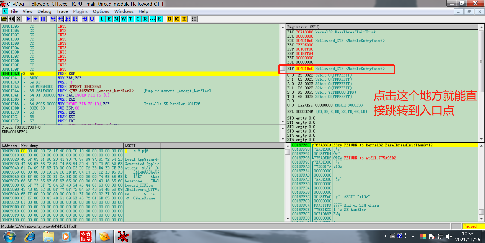

在ollydbg中可以看到程序入口点处的反汇编代码：

```asm
CPU Disasm
Address   Hex dump          Command                                  Comments
00401DA0  /$  55            PUSH EBP
00401DA1  |.  8BEC          MOV EBP,ESP
00401DA3  |.  6A FF         PUSH -1
00401DA5  |.  68 60394000   PUSH OFFSET 00403960
00401DAA  |.  68 261F4000   PUSH <JMP.&MSVCRT._except_handler3>      ; Jump to msvcrt._except_handler3
00401DAF  |.  64:A1 0000000 MOV EAX,DWORD PTR FS:[0]
00401DB5  |.  50            PUSH EAX
00401DB6  |.  64:8925 00000 MOV DWORD PTR FS:[0],ESP                 ; Installs SE handler 401F26
00401DBD  |.  83EC 68       SUB ESP,68
00401DC0  |.  53            PUSH EBX
00401DC1  |.  56            PUSH ESI
00401DC2  |.  57            PUSH EDI
00401DC3  |.  8965 E8       MOV DWORD PTR SS:[EBP-18],ESP
00401DC6  |.  33DB          XOR EBX,EBX
00401DC8  |.  895D FC       MOV DWORD PTR SS:[EBP-4],EBX
00401DCB  |.  6A 02         PUSH 2                                   ; /Arg1 = 2
```

**右键-edit-bianry copy** 


获取到第一个call指令之前的指令的十六进制表示，方便之后程序的修改：

```asm
55 8B EC 6A FF 68 60 39 40 00 68 26 1F 40 00 64
A1 00 00 00 00 50 64 89 25 00 00 00 00 83 EC 68
53 56 57 89 65 E8 33 DB 89 5D FC 6A 02
```

在刚才` CALL DWORD PTR DS:[76B01D70] ` 指令之后**右键-edit-bianry edit**

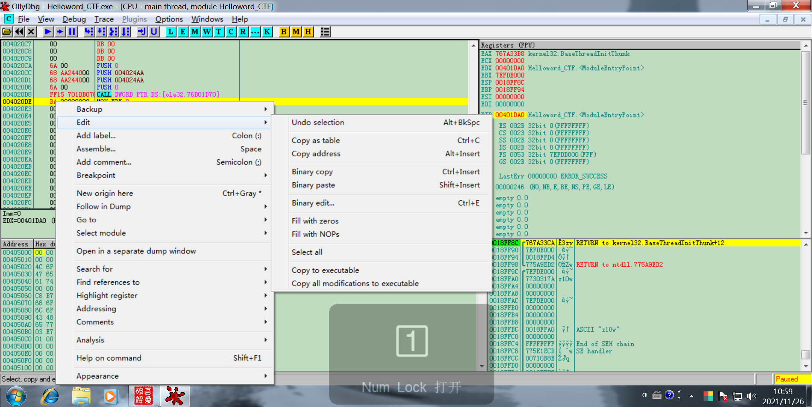

把上述十六进制内容粘贴到 hex 那一栏

然后再加上一行 `jmp 00401A00` 用于占位，稍后会把第一个call指令的位置放在这里。

- 寻找新的合适的位置存放标题和内容两个字符串

在上述编辑的代码之后空出一些位置继续编辑。

**右键-edit-bianry edit**

Title：

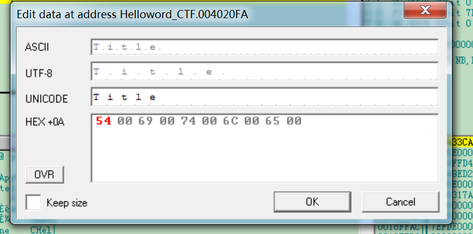

Content:

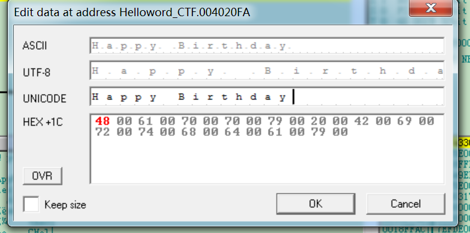

记住这两个字符串的地址，稍后要回到之前messagebox函数的地方，修改占位的内容为此时获得的地址，第二个push为标题的地址，第三个push为内容的地址

**那么到此为止，自己编写的逻辑部分基本完成了，稍后还要回来修改第一个call指令的地址。**

---

#### 2. 修改入口代码，跳转到自己代码的地址

双击eip指针，我们可以回到入口点。把从入口点开始到第一个call指令之前的内容全部填充为**nop**

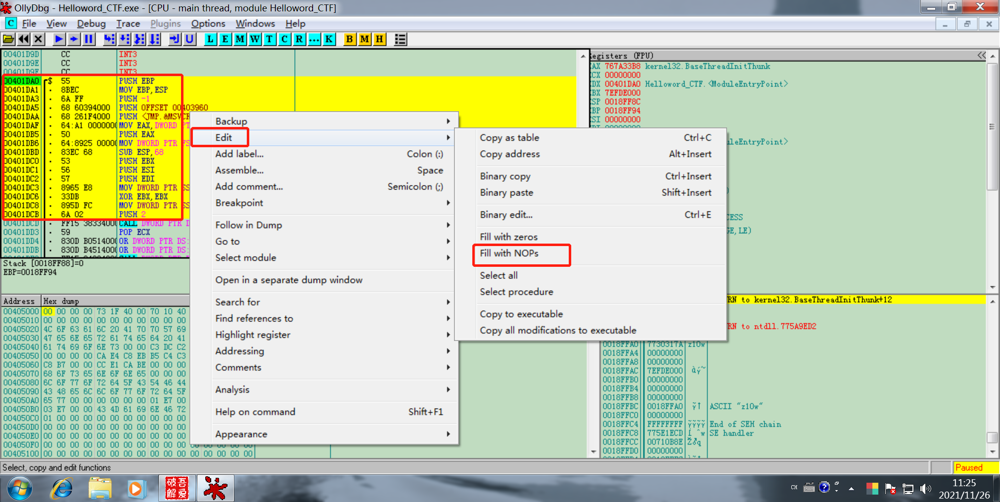

自己编辑的内容的开始地址：**004020CA**  , 我们需要在entrypoint处跳转至此，即在entrypoint处按空格后输入以下command：` jmp 004020CA `

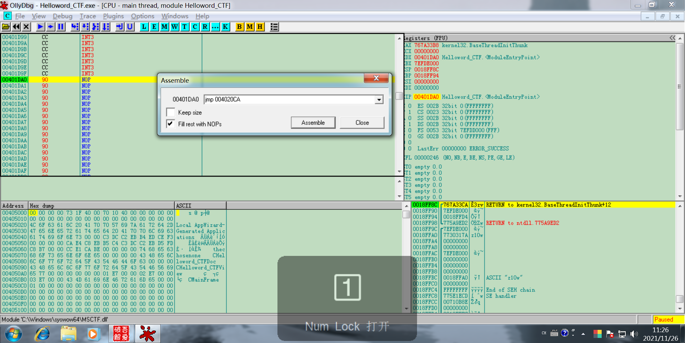

然后我们需要记下第一个call指令的地址 **00401DCD**，方便后续使用。

**那么修改EntyPoint这部分的工作就完成了。**

---

#### 3. 跳转回到原先第一个call指令的位置


从入口点进入的第一个call指令地址是：**00401DCD**

我们需要跳回到这个地址，在之前预留的占位处按下空格，输入下面的指令：` jmp 00401DCD `

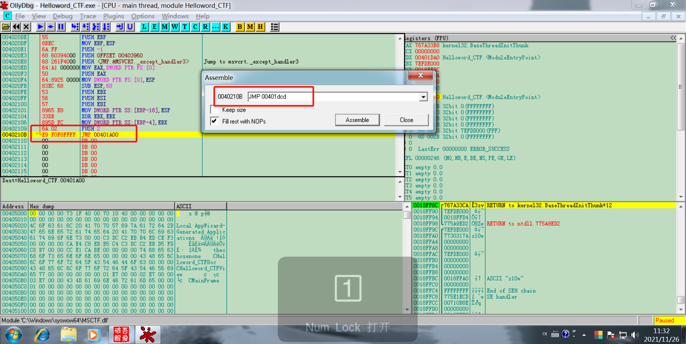

---

## 实验结果


---

## 参考资料

- [PE文件结构](https://masterxsec.github.io/2017/05/02/PE%E6%96%87%E4%BB%B6%E7%BB%93%E6%9E%84/)
- [OD反汇编EXE添加一个启动时的消息框](https://cloud.tencent.com/developer/article/1836762)


