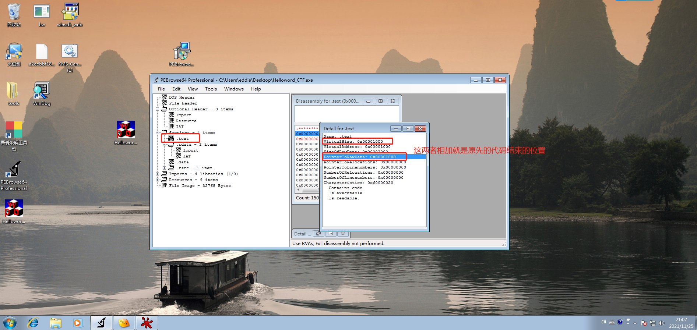
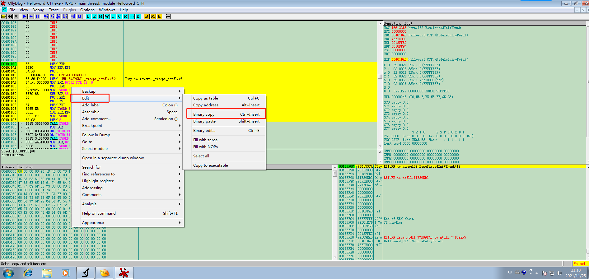
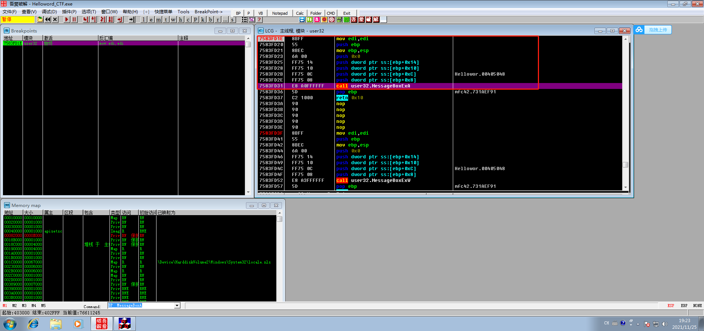
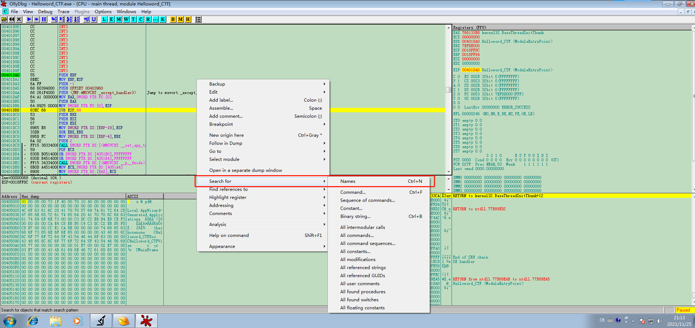

### 总体思路：

从入口开始执行自己编辑的代码，执行完成后跳转回去，继续执行原来的代码。

### 具体操作流程：

1. 找到合适的位置并编辑自己的代码逻辑
2. 修改入口代码，跳转到自己代码的地址
3. 跳转回到原先第一个call指令的位置


#### 寻找合适的位置并编辑自己的代码逻辑

- 为了方便，先用任意一款PE解析器查看结构，找到text节区



计算公式： **PointTorawDate + VirtualSize = 10c0+1000 = 20c0**


```asm
CPU Disasm
Address   Hex dump          Command                                  Comments
00401DA0  /$  55            PUSH EBP
00401DA1  |.  8BEC          MOV EBP,ESP
00401DA3  |.  6A FF         PUSH -1
00401DA5  |.  68 60394000   PUSH OFFSET 00403960
00401DAA  |.  68 261F4000   PUSH <JMP.&MSVCRT._except_handler3>      ; Jump to msvcrt._except_handler3
00401DAF  |.  64:A1 0000000 MOV EAX,DWORD PTR FS:[0]
00401DB5  |.  50            PUSH EAX
00401DB6  |.  64:8925 00000 MOV DWORD PTR FS:[0],ESP                 ; Installs SE handler 401F26
00401DBD  |.  83EC 68       SUB ESP,68
00401DC0  |.  53            PUSH EBX
00401DC1  |.  56            PUSH ESI
00401DC2  |.  57            PUSH EDI
00401DC3  |.  8965 E8       MOV DWORD PTR SS:[EBP-18],ESP
00401DC6  |.  33DB          XOR EBX,EBX
00401DC8  |.  895D FC       MOV DWORD PTR SS:[EBP-4],EBX
00401DCB  |.  6A 02         PUSH 2                                   ; /Arg1 = 2
```

**右键-edit-bianry copy** 

获取到第一个call指令之前的指令的十六进制表示：

```asm
55 8B EC 6A FF 68 60 39 40 00 68 26 1F 40 00 64
A1 00 00 00 00 50 64 89 25 00 00 00 00 83 EC 68
53 56 57 89 65 E8 33 DB 89 5D FC 6A 02
```











Breakpoints, 条目 0
 地址=7583FD1E user32.MessageBoxA
 模块=user32
 激活=始终
 反汇编=mov edi,edi


MessageBoxExW 的地址是：76B01D70，我们在前面四个语句之后加入下面一行代码（按空格）：

` CALL DWORD PTR DS:[76B01D70] `


自己编辑的内容的开始地址：**004020CA**  , 我们需要在entrypoint处跳转至此，即在entrypoint处按空格后输入以下command：

` jmp 004020CA `


从入口点进入的第一个call指令地址：**00401DCD**

所以我们需要跳回到这个地址，

使用下面的指令：

` jmp 00401DCD `


